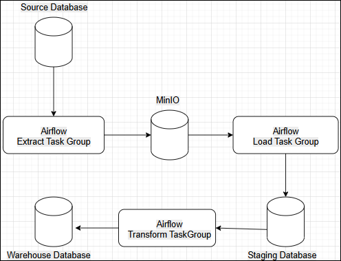
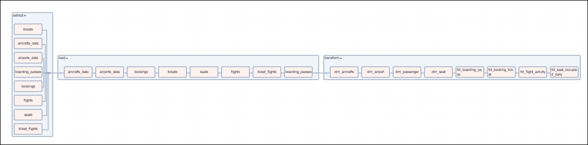
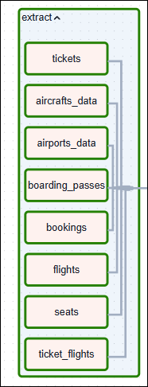
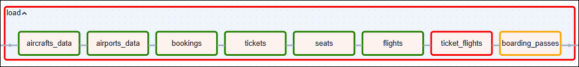
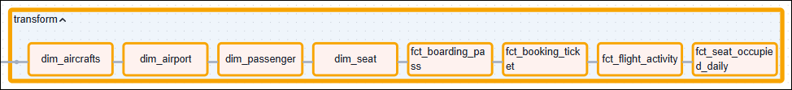
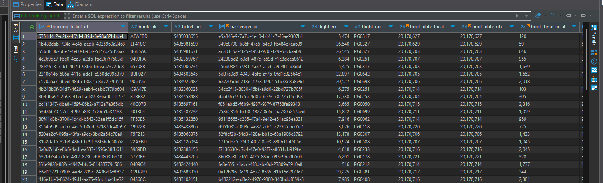
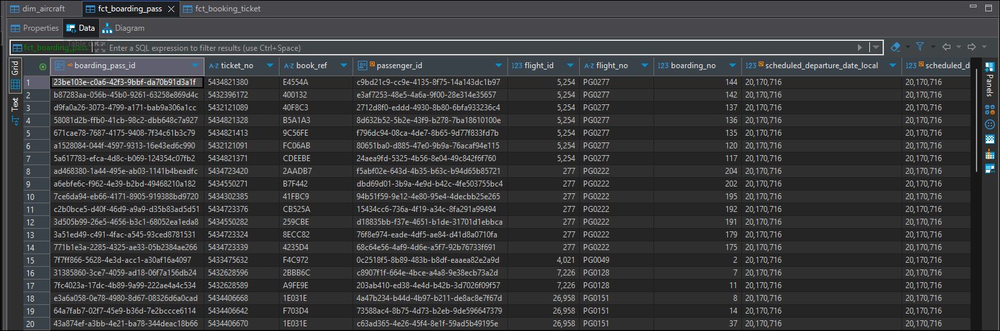

# Flights Data Pipeline
This project demonstrates a complete ETL pipeline for a simulated flight booking system using Apache Airflow, PostgreSQL, and MinIO. All orchestrated via Docker Compose.

## Table of Contents
* [Project Overview](#project-overview)
* [Architecture Overview](#architecture-overview)
* [Pipeline Flow](#pipeline-flow)
* [How to Run the Project](#how-to-run-the-project)
* [Screenshots](#screenshots)

## Project Overview
The goal of this project is to build a reliable and automated data pipeline that performs :
1. Data Extraction from a PostgreSQL source database
2. Data Loading into a MinIO object store (as CSV) and PostgreSQL staging schema
3. Data Transformation from staging to warehouse tables
4. Workflow orchestration using Airflow with TaskGroups

## Architecture Overview
### System Components :
1. PostgreSQL – as source, staging, and warehouse databases
2. MinIO – acts as a data lake to store extracted CSVs
3. Apache Airflow – used for DAG orchestration
### Services Diagram :


## Pipeline Flow
### 1. Extract
- Extracts tables from source PostgreSQL (bookings schema)
- Stores each table as a CSV file in MinIO at:<br>
<b>/extracted-data/temp/<table_name>.csv</b>
- Done in parallel using PythonOperator

### 2. Load
- Reads CSVs from MinIO
- Loads data into the staging schema of PostgreSQL (upsert logic)
- Tables loaded in specific order using PythonOperator

### 3. Transform
- Transforms staging tables into dimensional and fact tables
- Executes SQL scripts using PostgresOperator
- Final tables follow naming convention like dim_airport, fct_booking_ticket, etc.

## How to Run the Project
1. Clone the Repository
```bash
git clone https://github.com/yourusername/flights-data-pipeline.git
cd flights-data-pipeline
```
2. Extract file src-init-db into init.sql
3. Start Docker Compose
```bash
docker compose up -d
```
4. Access Airflow UI
- Navigate to http://localhost:8080
- Login: admin / admin
- Activate the DAG: flights_data_pipeline
4. Simulate a Run
- Trigger the DAG manually or wait for the scheduled run
- Monitor progress through TaskGroups: Extract, Load, and Transform
## Screenshots
### Airflow DAG Overview

### Task Group Details
Extract Task Group



Load Task Group

Transfrom Task Group

### Sample Output Warehouse Tables
Table fct_booking_ticket

Tablle fct_boarding_pass

